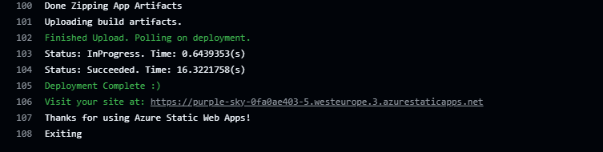

## Preview Deployment (Uppgift 1)

Varje gång en Pull Request öppnas mot `vecka-41-dev` triggas en automatisk Preview Deployment via Azure Static Web Apps.

Det möjliggör agil kodgranskning i en tillfällig miljö innan ändringarna mergas till dev.

## Staging Deployment (Uppgift 2)

Den permanenta Staging-miljön är kopplad till `vecka-41-dev`-branchen.  
Varje gång kod mergas till `vecka-41-dev` uppdateras denna miljö automatiskt.

**Staging-URL:**  
https://purple-sky-0fa0ae403.azurestaticapps.net

Till skillnad från Preview-URL:en (som tas bort när en PR stängs) är detta en stabil länk.  
Den delas med externa intressenter, som produktägare, för att granska och testa godkända ändringar.
